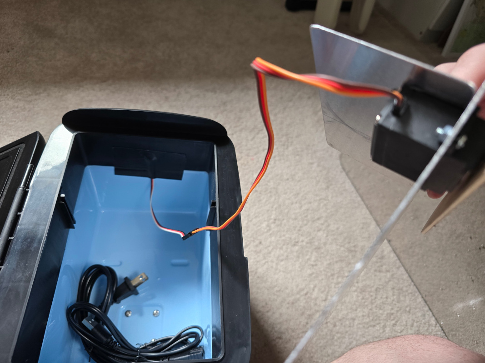
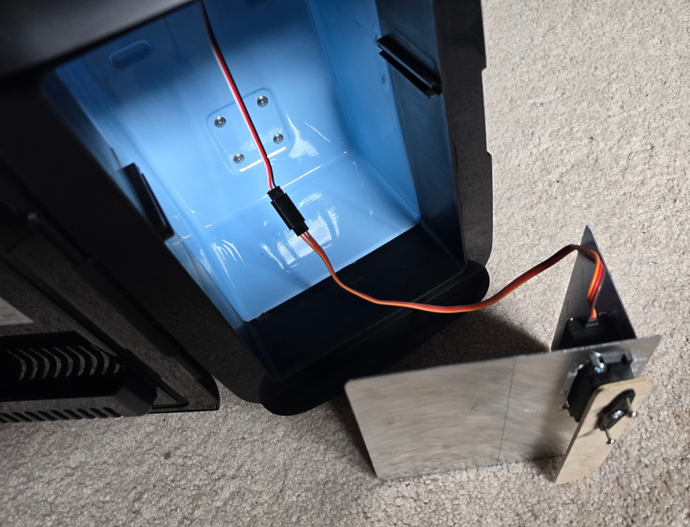
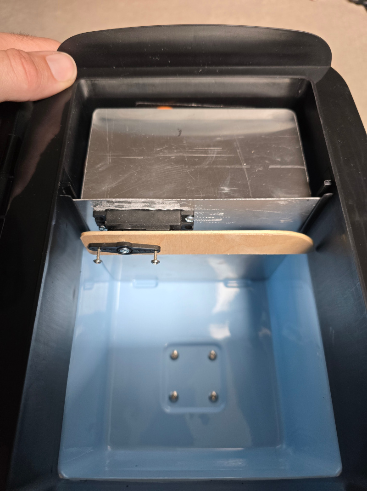
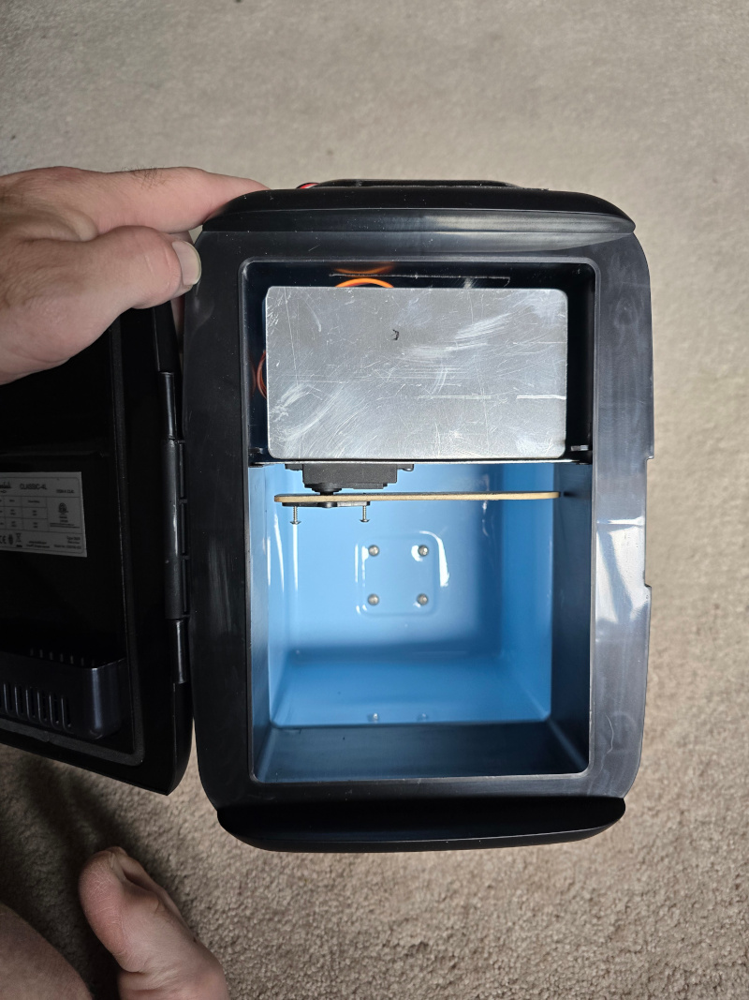
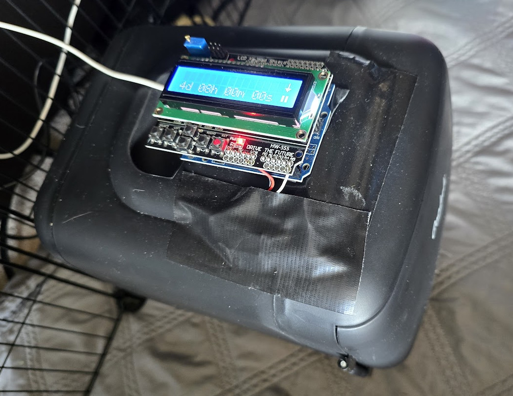

# fridgefeeder

fridgefeeder automatically feeds fresh vegetables to guinea pigs (or similar animals) while you're away.

The veggies for a day are kept in [an inexpensive micro-fridge](https://www.amazon.com/dp/B0771S9XT8) until dinner time when an [Arduino Uno](https://www.amazon.com/dp/B0D83J2TJJ) commands a servo ([example](https://www.amazon.com/dp/B076CNKQX4)) to push open the door from the inside of the fridge.  An [LCD/keypad shield](https://www.amazon.com/dp/B00OGYXN8C) allows easy setup.  To automatically feed for multiple days, have one fridgefeeder per day you'll be gone.

## Usage

The keypad on the control module has 6 buttons: left, right, up, down, select, and reset.  Use left and right to scroll through different options, use up and down to adjust values, and use select to perform an action.  Do not press the reset button except to reset the control module.

### Physical setup

1. Place the fridgefeeder in the guinea pig enclosure in advance
2. Power the fridgefeeder cooling with one of the cables provided with the fridge
3. Power the fridgefeeder control module with an appropriate USB cable and USB power supply
4. Give enough time for the fridge to cool down
5. Add a serving of veggies to the fridge

### Opening configuration

The fridgefeeder has a countdown until the fridge door opens.  This section sets the time until opening and starts the countdown.

1. If the countdown is active and you want it to stop while you set up the timer, scroll left or right until the arrow at the top of the LCD points to the play icon and then press the select button to pause countdown
2. Scroll left and right to select the days, hours, minutes, and seconds
    1. Use the select button to zero the selected units
	2. Use the up and down buttons to adjust the selected units
3. After the appropriate amount of time is selected and the appropriate time arrives, start the countdown by scrolling left or right to the pause icon and pressing the select button

## Construction

### Opener assembly

The opener assembly holds a servo attached to a long arm and slides into the track for the freezer tray.

1. Cut a rectangle the size of the freezer tray out of aluminum, plastic, or possibly birch sheet (although this is prone to water damage from condensation)
2. Cut a rectangular hole big enough for the servo near the front of the tray on one side
3. Drill two holes to fit the servo mounting brackets, and use two (or more) screws and nuts to attach the servo to the tray upside down on the hindge side of the fridge
4. Cut an opener arm out of a similar material so that it easily fits inside the fridge, but is otherwise as long as practical.
    1. It should be thick enough to easily mount to the servo and be strong enough to open the door
	2. The end that will contact the door should be curved to gently open the door
5. Drill a hole through the pivot of the opener arm large enough to all the servo arm's servo mounting tube to fit through
6. Attach the servo arm to the opener arm with two screws
7. Attach the servo arm (with the opener arm) to the servo with the mounting screw (probably an M3)
8. Cut a rectangle slightly smaller than the front of the freezer area; this will be the front panel of the opener assembly
9. Attach this rectangle to the servo (at a right angle to the freezer tray) to prevent guinea pigs from getting to the servo and chewing on wires

### Servo pass-through

The Arduino and interface will be mounted outside the fridge while the servo needs to open the door from inside the fridge.  So, we need a servo extension to penetrate through the fridge.

1. Estimate where the metal interior of the fridge ends front-to-back
2. Drill a 3/8" hole through the top of the fridge
	1. Make sure the hole is far enough back not to interfere with the front panel of the opener assembly
	2. Make sure the hole is far enough forward not to penetrate the metal interior of the fridge
3. Pass a 3-pin male-female servo extension cable through the hole, leaving a couple inches free outside the fridge
4. Duct-tape over the hole (and servo extension cable) both inside and outside the fridge
5. Connect the opener assembly to the pass-through extension cable
6. Insert opener assembly into the fridge using the freezer tray guides

### Control module

The Arduino control module consists of an Arduino Uno plus LCD+keypad shield.  This control module connects to the servo via the pass-through extension cable above and commands the servo to move at the appropriate time.  The control module is usually powered by a USB cable and USB power supply, but any power supply to the Arduino board of at least 5V should be fine.

1. Cut the end off a second 3-pin servo extension which connects to the servo extension outside the fridge
2. Solder the bare wires of the cut extension:
	1. The black/dark wire to a ground pin on the LCD+keypad shield
	2. The red/middle wire to a +5V pin on the LCD+keypad shield
	3. The white/signal wire to A5 on the LCD+keypad shield
3. Mount the LCD+keypad shield on the Arduino Uno
4. Using VHB or other strong double-sided adhesive, attach the Arduino to the top of the fridge
    1. Don't interfere with the handle -- the Arduino can sit just in front of it
	2. Attach over top of the taped pass-through
5. Make sure the servo pass-through extension is connected to the half-extension cable soldered to the LCD+keypad shield
6. Duct-tape the cable pair to the fridge off to the side of the control module

### Servo setup

The fridgefeeder needs to know where to put the servo when the door is closed and where to put the servo when the door is open.  This usually only needs to be done once when the fridgefeeder is constructed, but it can be done again if the opener arm isn't moving to the right positions.

1. Scroll left or right until seeing "Closed:"; the servo will move to the closed position
2. Scroll up or down to set the servo position when the door is closed; the opener arm should be well inside the fridge and not interfere with the door
3. Scroll left to "Open:"; the servo will move to the open position
4. Scroll up or down to set the servo position when the door is open; the opener arm should open as far as practical without running into the edge of the fridge
5. Scroll right until seeing "Save?" and press the select button to save these settings to memory (screen will show "Saved.")
